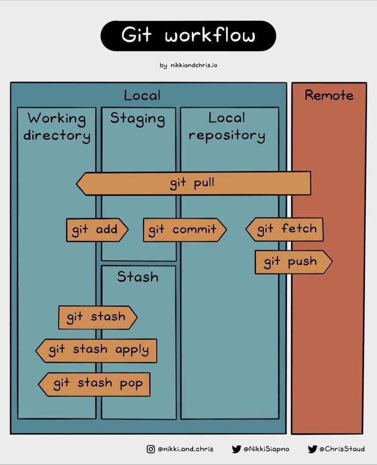

# Git & Github

Github est un service en ligne qui permet d'héberger des dossiers de codes ET de conserver tout l'historique de modifications sur chacun des fichiers que l'on souhaite suivre (i.e ceux qui ne se trouve pas dans le fichier .gitignore). 

Git est l'outil de versionning qui va permettre d'interagir avec Github depuis un client (notre ordinateur local ou déporté).

Pour travailler avec Git et Github, il est donc necessaire de:
1. Se créer un compte (Gratuit) 
2. Télécharger et installer Git sur le client sur lequel on va developper (_pour débuter, vous pouvez choisir d'interagir avec Github en utilisant Github Desktop qui est un logiciel qu iva se charger d'executer les commandes Git pour nous_)
3. Apprendre la logique de travail (CLONE, COMMIT, PULL, PUSH)

Pour plus de détails pour ces différentes étapes lire [cette article](https://datascientest.com/git-tutoriel-sur-le-systeme-de-controle-de-versions-du-developpeur) sur le blog de DataScientest.

Le dossier en ligne sur Github doit **TOUJOURS avoir la toute dernière version à jour de notre code**. L'objectif est de toujours sauvegarder (ailleurs qu'en local sur notre ordinateur le code du projet sur lequel on travail). De plus, héberger le code en ligne (bien entendu de manière sécurisée) va également permettre la collaboration vu que les différents collaborateurs pourront directement avoir accès à la dernère version du code **ainsi qu'à tout l'historique des modifications**.

_Remarque:_
Souvent, lorsque vous avez travaillé sur une partie de votre projet, les choses sont dans un état désordonné et vous voulez sauvegarder votre travail quelque temps (sans faire de commit) et changer de branche pour travailler sur autre chose. 

Le problème est que vous ne voulez pas faire un commit de travail à moitié fait juste pour pouvoir revenir à ce point plus tard. Pour cela vou spouvez utiliser la commande `git stash` pour mettre en cache pendant un temps votre travail en cours.

La mise en cache prend l'état 'non finalisé' de votre répertoire de travail - c'est-à-dire vos fichiers suivis modifiés et vos changements indexés -
et le sauvegarde sur une pile de changements non terminés que vous pouvez réappliquer à tout moment.

>Après des modifications non finalisées, vous pouvez simplement executer la commande `git stash` pour les sauvegarder (sans les prendre en compte dans les prochains commit). Pour accéder à la liste des modifications stoquées dans la mémoire cache, vous pouvez utiliser la commande `git stash list`.
>
>Si vous voulez appliquer un des anciens stashs, vous pouvez le spécifier en le nommant, comme ceci : `git stash apply stash@{numéro du stash}`. Si vous ne spécifiez pas de stash, Git prend le stash le plus récent et essaie de l'appliquer.

## Quelques recommandtations:

1. Créer le repo en ligne
2. Décrire de manière succinte l'objectif du projet dans le fichier README (il faut donc pense à l'inclure dès le début)
3. créer la structure de son projet
4. inviter des collaborateurs (ces derniers consulteront le README avant d'effectivement commencer leurs travaux)
5. commencer par se créer des branches (en fonction de l'organisation du groupe)
  
Le README peut également servir pour décrire la logique de création des branches

## Bonnes Pratiques sur Github

1. Structurre le projet

Commencer par créer la logique de stockage des différents fichiers. Ceci pour éviter de devoir tout modifier et casser des dépendance entre ces derniers. On va prendre l'exemple d'un projet de Data Science.

On aura par exemple besoin de:

* Un dossier de données:

Dans la pratique on va laisser les fichiers de données en local sur un ordinateur ou alors mettre ces derniers dans le cloud (exemple dans un bucket S3). Ici notre jeu de données est de petite taille, on peut donc se permettre de le laisser sur Github. On peut également mettre le fichier compressé sur Github (si la taille de ce dernier le permet))

* Un dossier contenant notre code source
* Documenter dans ce fichier README du sous dossier demo_git_github la logique de stockage pour que tous les membres suivre cette dernière
